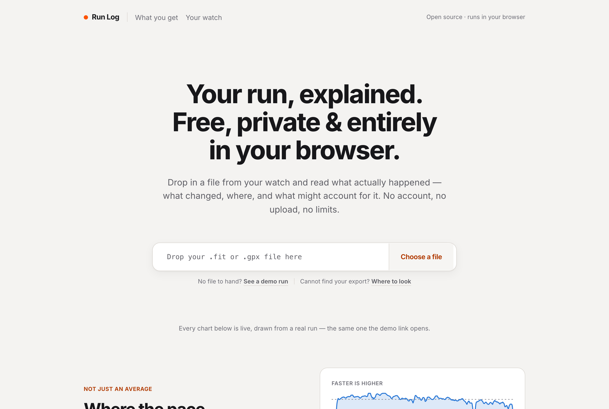
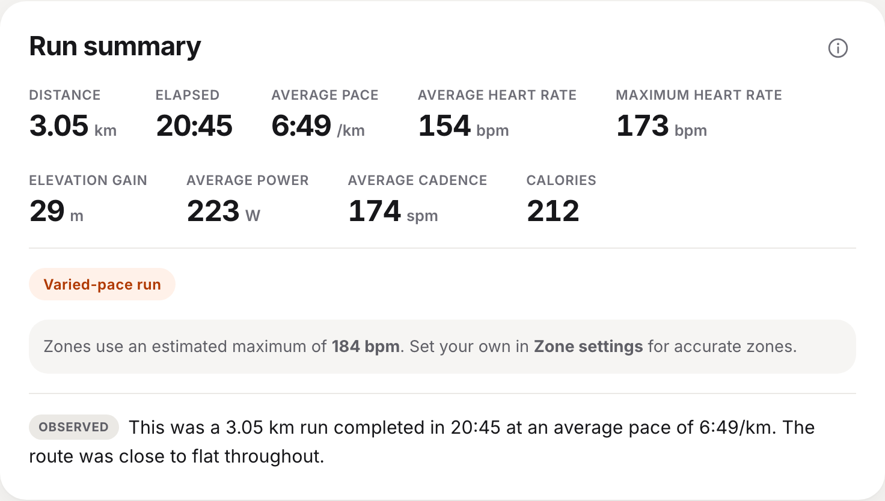
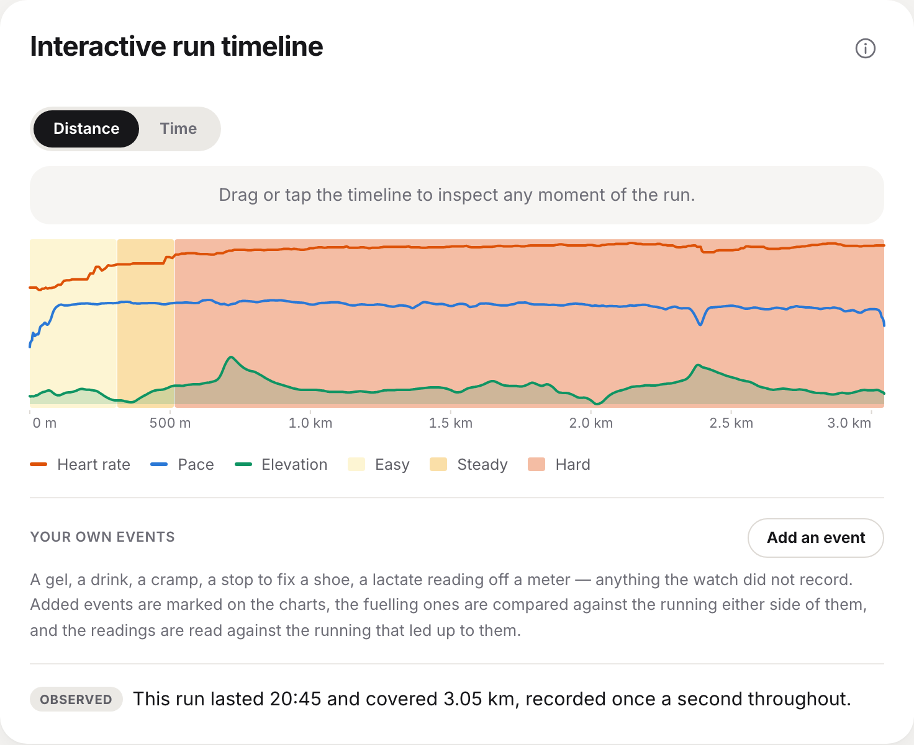
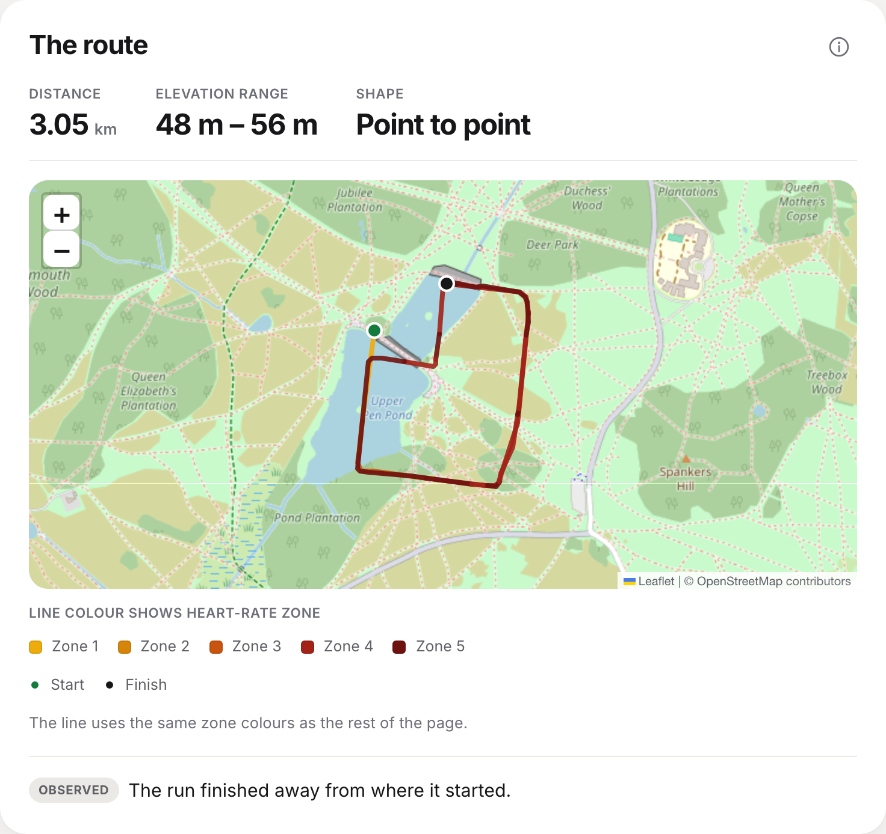
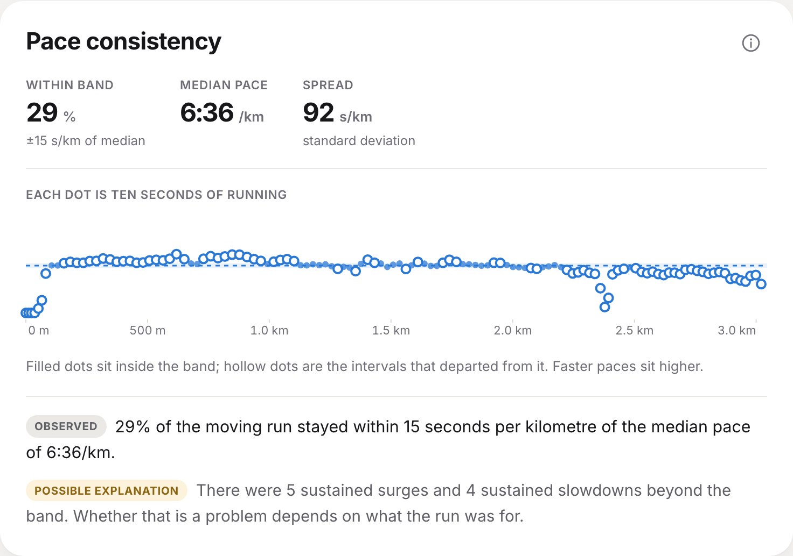
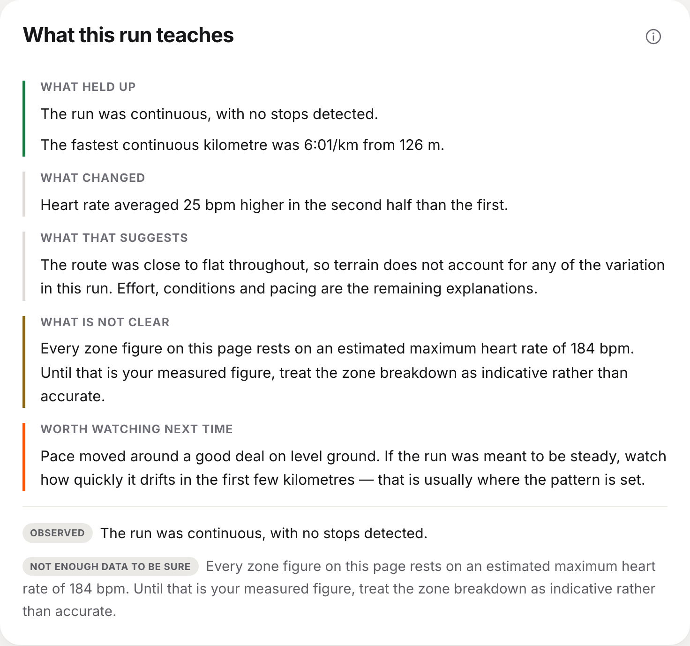
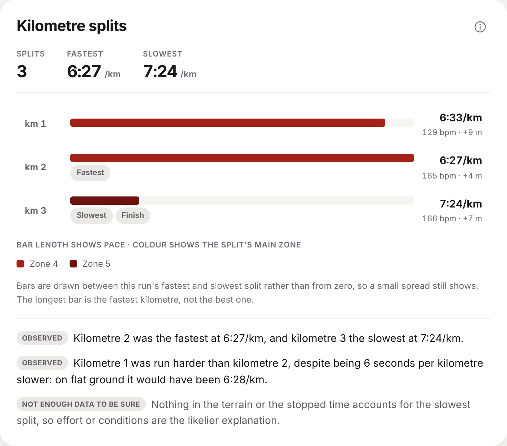

<div align="center">

# Run Log

### Your run, explained.

Drop in a file from your watch and read what actually happened —
what changed, where, and what might account for it.

**[runlogapp.com](https://runlogapp.com)**

No account. No upload. Everything runs in your browser.

</div>

<div align="center">
  
</div>

---

Most running apps show you totals and charts, then leave you to work out what
they mean. Run Log walks through a single run and explains what changed, where,
and what might account for it.

## What it does

For one activity file, the page answers five questions in order.

**1. What happened?** — the totals, and a run-type badge.



**2. Where did it happen?** — a draggable timeline and a real map, both synced
to the same cursor.





**3. Which metrics changed together?** — relationship cards showing what moved
at the same moment.

**4. What might explain the change?** — every explanation carries its
confidence, and is kept visibly separate from what was measured.



**5. What does that metric mean?** — a short teaching note, specific to this
run.



A contents rail on the left tracks where you are and lets you jump straight to
a section; on narrow screens it collapses into a **Contents** button. Each card
shows only what happened — press the **ⓘ** and it turns over to reveal what the
metric means.

## The one idea

Every card separates **what your watch measured** from **what was inferred from
it**, and an inference cannot be written without stating how confident it is.
That is enforced in the types, not by style guide: an `Explanation` requires a
`confidence` of `high`, `medium` or `low`, which the page renders as *Likely
explanation*, *Possible explanation* or *Not enough data to be sure*.

Nothing is ranked or scored. A slower split is usually a hill, and a single
number would hide exactly the context this project exists to surface.



## Getting started

```bash
npm install
npm run dev      # http://localhost:5173
npm test         # parser, pipeline and widget tests
npm run build    # static output in dist/
```

Drop in a `.fit` or `.gpx` file, or press **See a demo run**.

A local build sends nothing anywhere.

## Reading further

| | |
|---|---|
| [**Architecture**](docs/ARCHITECTURE.md) | How a file becomes a page: the parsers, the pipeline, the widget contract, and how to add a widget |
| [**Design decisions**](docs/DESIGN.md) | The choices with plausible alternatives, and why each went the way it did |
| [**Privacy**](docs/PRIVACY.md) | The three things that talk to a server, in full |
| [**Contributing**](CONTRIBUTING.md) | Setup and the trunk-based flow |
| [**Conventions**](CONVENTIONS.md) | Commit-message format |

## Data support

| Format | Position | Elevation | Heart rate | Cadence | Power |
|---|---|---|---|---|---|
| FIT | ✅ | ✅ | ✅ | ✅ when recorded | ✅ |
| GPX | ✅ | ✅ | ✅ Garmin extension | ✅ when recorded | ✅ Strava extension |

## Support

Run Log is free, has no account, and no plans to be anything else. If it showed
you something about your running, you can
[buy me a coffee](https://buymeacoffee.com/wallid) ☕ — it goes on the domain
and the hosting.

The site links to that page and nothing more: no embedded button, no widget
script, nothing third-party that runs before you decide to click. That is the
same rule as the rest of the page.

## Disclaimer

Run Log describes recorded data; it is not medical, coaching or training
advice. Everything on the page is read or inferred from a consumer device —
optical heart rate, modelled power, a smoothed barometric trace — and any of it
can be wrong, individually or together. The experimental sections go further
and say so on every card: they apply published research outside the conditions
it was tested under. Nothing here diagnoses, treats or prevents anything. For a
symptom, an injury, or a reading that worries you, see a qualified professional
rather than a chart. The software itself is provided as-is, without warranty of
any kind, per the licence below.

## Licence

MIT.

Map tiles © [OpenStreetMap](https://www.openstreetmap.org/copyright) contributors.
